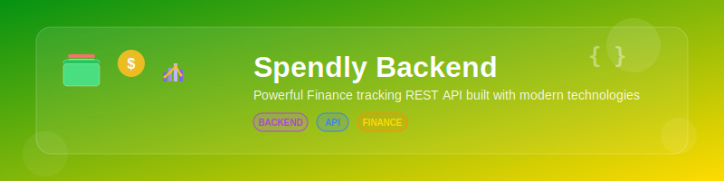

<div align="center">
   
[](https://github.com/zenpai6996/Spendly-backend)

[](https://github.com/zenpai6996/Spendly-backend/blob/main/LICENSE)
[](https://nodejs.org/)
[](https://mongodb.com/)
[](https://expressjs.com/)

*A robust, scalable backend API for personal finance management*

[📚 **API Documentation**](./APIDOCS.md) • [🚀 **Getting Started**](#-quick-start) • [🤝 **Contributing**](#-contributing)

</div>

---

## ✨ Overview

Spendly Backend is a powerful REST API designed for modern finance tracking applications. Built with enterprise-grade architecture, it provides secure user management, transaction handling, and comprehensive financial analytics.

## 🎯 Key Features

<table>
<tr>
<td width="50%">

### 🔐 **Authentication & Security**
- JWT-based authentication
- Secure password hashing with bcrypt
- Protected route middleware
- Profile image upload support

### 📊 **Financial Management**
- Income & expense tracking
- Real-time dashboard analytics
- Historical transaction data
- Excel export functionality

</td>
<td width="50%">

### 🏗️ **Architecture**
- RESTful API design
- Modular Express.js structure
- MongoDB with Mongoose ODM
- Automated CRON jobs

### 📈 **Analytics**
- 30-day expense summaries
- 60-day income tracking
- Transaction categorization
- Balance calculations

</td>
</tr>
</table>

## 🛠️ Technology Stack

<div align="center">

| **Backend** | **Database** | **Authentication** | **Utils** |
|:-----------:|:------------:|:------------------:|:---------:|
|  |  |  |  |
|  |  |  |  |

</div>

## 🚀 Quick Start

### Prerequisites

Ensure you have the following installed:
- **Node.js** v18.0.0 or higher
- **npm** v8.0.0 or higher  
- **MongoDB** v4.4 or higher

### Installation

1. **Clone the repository**
   ```bash
   git clone https://github.com/zenpai6996/Spendly-backend.git
   cd Spendly-backend
   ```

2. **Install dependencies**
   ```bash
   npm install
   ```

3. **Environment setup**
   ```bash
   cp .env.example .env
   # Edit .env with your configuration
   ```

4. **Start the server**
   ```bash
   npm start
   ```

The API will be available at `http://localhost:3000/api/v1/`

## 📋 API Overview

<div align="center">

| **Category** | **Endpoints** | **Description** |
|:------------:|:-------------:|:---------------:|
| 🔐 **Auth** | 4 endpoints | User authentication & profile management |
| 📊 **Dashboard** | 1 endpoint | Financial overview & analytics |
| 💰 **Income** | 4 endpoints | Income tracking & management |
| 💸 **Expense** | 4 endpoints | Expense tracking & categorization |

</div>

**Quick API Reference:**

```http
POST   /api/v1/auth/register     # User registration
POST   /api/v1/auth/login        # User login
GET    /api/v1/dashboard         # Financial dashboard
POST   /api/v1/income/add        # Add income transaction
POST   /api/v1/expense/add       # Add expense transaction
```

> 📚 **[View Complete API Documentation →](./APIDOCS.md)**

## 🏗️ Project Structure

```
spendly-backend/
├── 📁 controllers/          # Request handlers
├── 📁 middleware/           # Custom middleware
├── 📁 models/              # Database schemas
├── 📁 routes/              # API routes
├── 📁 utils/               # Helper functions
├── 📄 server.js            # Application entry point
└── 📄 package.json         # Project dependencies
```


## 🤝 Contributing

Contributions are welcome ! Here's how you can help:

<div align="center">

[](https://github.com/zenpai6996/Spendly-backend/fork)
[](https://github.com/zenpai6996/Spendly-backend/issues)
[](https://github.com/zenpai6996/Spendly-backend/pulls)

</div>

### 🧑‍💻 Development Workflow

1. Fork the repository
2. Create a feature branch: `git checkout -b feature/amazing-feature`
3. Commit changes: `git commit -m 'Add amazing feature'`
4. Push to branch: `git push origin feature/amazing-feature`
5. Open a Pull Request

## 📄 License

This project is licensed under the [MIT License](LICENSE) - see the license file for details.


<div align="center">
    
</div>
